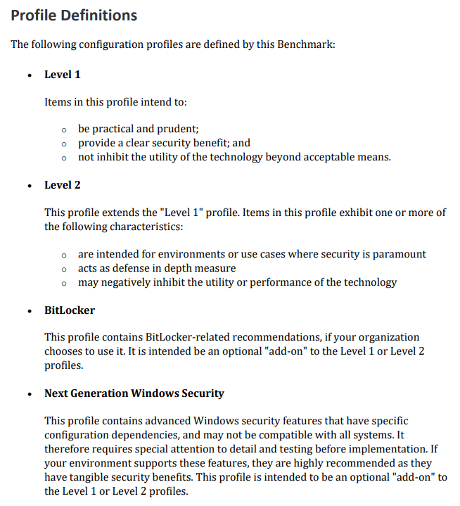
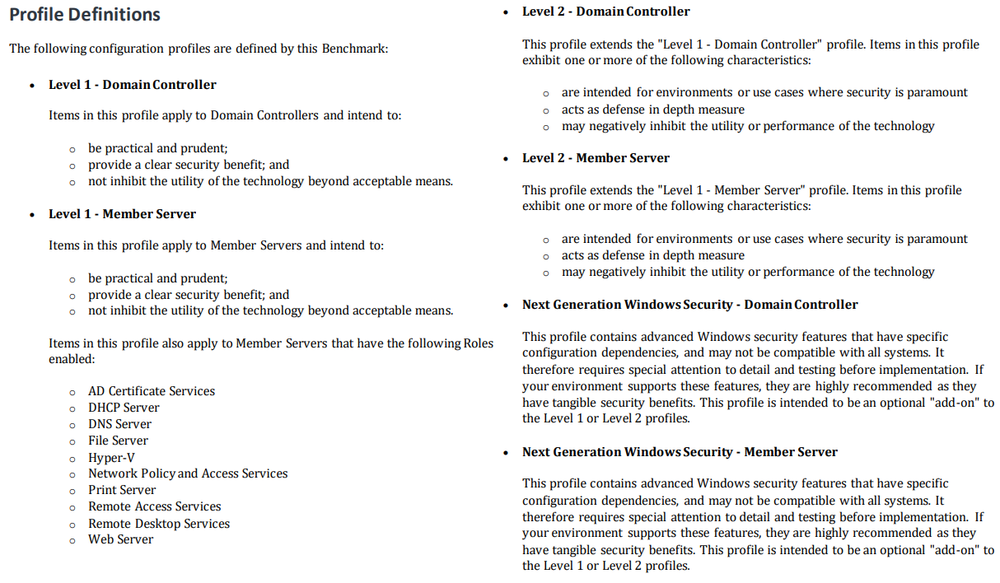
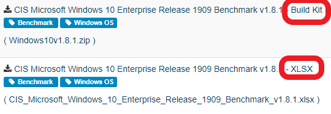

# What is CIS?
[CIS](https://www.cisecurity.org/) is a community driven nonprofit organization that publishes widely accepted security benchmarks for a variety of applications and operating systems.
They offer security recommendations for Windows in the following profiles.

Windows 10 Enterprise
 

Windows Server
 

# How do I get the CIS documentation?
The benchmarks are available via the [CIS workbench](https://workbench.cisecurity.org/) and require a free account to access.

There is a lot of items available via the workbench site so it's easiest to find what you're looking for with tags.
 

It is important to get the most recent version of these items. All versions are made available on this site. You will need the excel copy of the benchmarks and the build kit (GPOs for Windows) for most cases.
 

# How do I open tickets for feedback?
1) Sign into [CIS workbench](https://workbench.cisecurity.org/)
2) Navigate to the [communities page](https://workbench.cisecurity.org/communities/public)
3) Search for and join the 'CIS Microsoft Windows Benchmarks' community. Without this step you can view benchmark tickets but not create them so do not assume you've already done this.
4) Now you can locate your benchmark from the [benchmarks page](https://workbench.cisecurity.org/benchmarks)
5) Once you've entered your benchmark specific page you can drill down to the specific recommendation with the issue and open a ticket for the correction.

# CISCAT
This application is referenced throughout this projects documentation. It is an assessment tool maintained by CIS. It can generate reports comparing your system state to a given benchmark. It is available for [download](https://workbench.cisecurity.org/files/2151) from CIS workbench and its documentation can be found [here](https://ccpa-docs.readthedocs.io/en/latest/Configuration%20Guide/). It is best to use CMD instead of PowerShell ro run the batch file.
