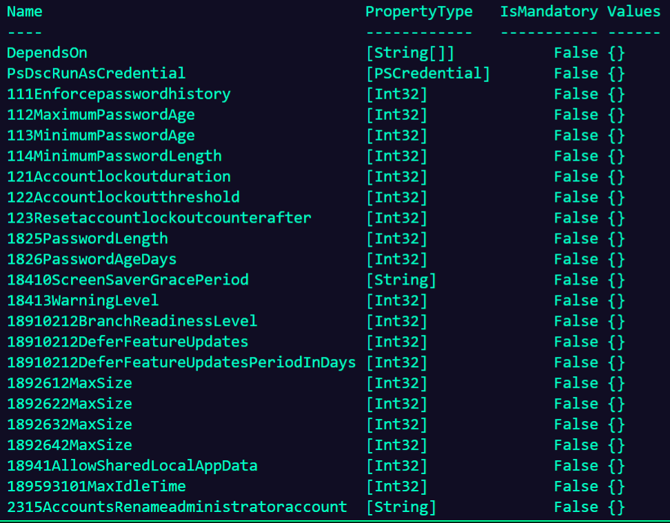

# How do I exclude recommendations?
It is not uncommon for a recommendation to need to be excluded from configurations or slightly adjusted. These resources have built-in support for these situations.
Every resource contains an 'ExcludeList' property that allows you to exclude settings based on their recommendation ID. These IDs can be found in the CIS documentation available from [CIS](src/../cis_documentation.md) or the [documentation page](https://github.com/techservicesillinois/SecOps-Powershell-CISDSC/wiki/Benchmark-documentation) of this repository. Using these PDFs you should be able to identify your setting in question and locate it's ID number. Enabling exclusions will look similar to the below example.

```
Configuration Win10_1909_L1
{
    Import-DSCResource -ModuleName 'CISDSC'

    node 'localhost'
    {
        CIS_Microsoft_Windows_10_Enterprise_Release_1909 'CIS Benchmarks'
        {
            #These exclusions are services that are not in default installs of Windows. Remove the exlusions if they are applicable to your envrionment.
            'ExcludeList' = @('5.6','5.7','5.10','5.11','5.14','5.28','5.32','5.40')
            '2315AccountsRenameadministratoraccount' = 'CISAdmin'
            '2316AccountsRenameguestaccount' = 'CISGuest'
            '2375LegalNoticeText' = 'Legal says only we can use these machines.'
            '2376LegalNoticeCaption' = 'Legal Notice'
        }
    }
}
```

# How do I customize values of recommendations?
Some recommendations are for ranges of values not an explicit value. An example being a minimum numbers of days or log size vs enabled/disabled. These customizations are also accounted for in these resources via parameters. Available parameters can always be found with the below command substituting the resource name for your applicable OS.

```
(Get-DscResource -Module CISDSC -Name CIS_Microsoft_Windows_10_Enterprise_Release_1909).Properties
```

This will return something resembling the below screenshot. The naming convention is as follows: '111Enforcepasswordhistory' configures "1.1.1 (L1) Ensure 'Enforce password history' is set to '24 or more
password(s)'". You can use the documentation linked above to identify the accepted values for this setting. The above code example also shows how to specify a parameter.
</br>

# Special cases
There are a handful of special cases for customization. Those are pictures above for the legal disclaimer text and built-in account renames. These will require a value be provided as shown or their recommendation IDs be added to the ExclusionList. This is due to the fact that these field are always organization specific so there are no safe defaults for these values.