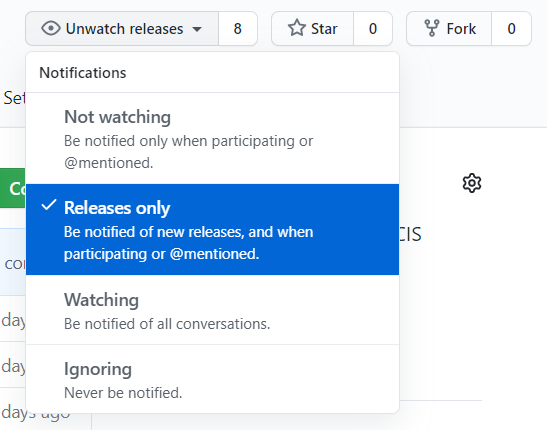

# How can I be notified of new releases?
1) Create a GitHub account if you don't already have one.

2) On the home page of this repository start watching releases.
</br>

3) Assuming your notification settings are set to email (which is the default) you will be notified when a new version of the module is released.

4) You can then update the module with the below PowerShell
```
# This will update the local machine
Update-Module -Name 'CISDSC'

# This will download a copy of the module and its dependencies to the specified location
Save-Module -Name 'CISDSC' -Path 'Replace Me'
```