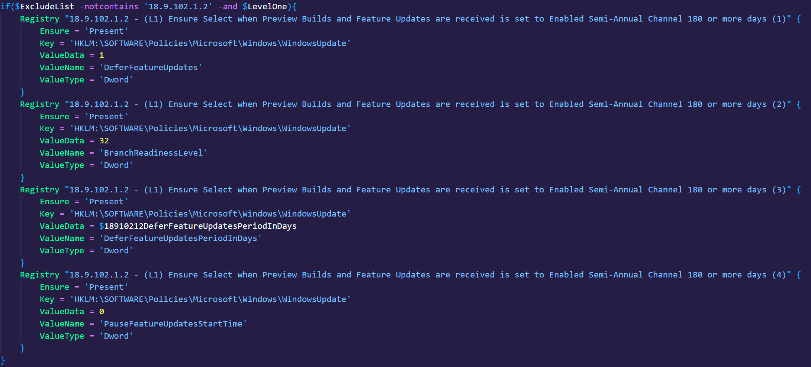

# Resource Parameters

## How are parameters decided on?
- Keywords in the title of recommendations decide if a parameter is appropriate. Currently these are:
  - "or more"
  - "or fewer"
  - "or greater"
  - "or less"

- There are also special cases for a few recommendations that will always generate a parameter with no default value.
  - "(L1) Configure 'Interactive logon: Message text for users attempting to log on'"
  - "(L1) Configure 'Interactive logon: Message title for users attempting to log on'"
  - "(L1) Configure 'Accounts: Rename administrator account'"
  - "(L1) Configure 'Accounts: Rename guest account'"

## How are default values assigned?
- Numbers in the title are parsed out and out of the applicable settings associated with that recommendation the one with the matching value to the title is decided to be the default value and configurable setting. See the below example where multiple settings are tied to a recommendation but only the appropriate setting is parameterized.  

## Can these be overridden?
- Yes, ConvertTo-DSC accepts a ParameterOverridesPath which is a CSV that lets you enable/disable a parameter for a given recommendation ID. Examples of these files can be found in the [parameter_overrides](/csvs/parameter_overrides) directory.

## How can I add validation blocks?
- Parameter validation is required to ensure IT pros don't customize themselves out of the baseline. After researching the settings supported values a standard powershell validation block should be crafted. Examples of how to specify and format these can be found in the [parameter_validations](/csvs/parameter_validations) directory.
