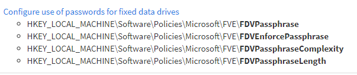
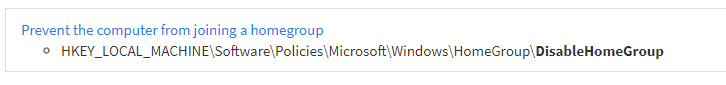

# Static Corrections
## What are we statically correcting?
Occasionally there are will be some discrepancies between the build kit (GPOs) and the benchmark documentation. These will be placed in a 'RecommendationErrors.txt' file when those are provided to 'ConvertTo-DSC'. These discrepancies typically fall into one of the following categories. Recommendations that failed to find a match will be exported to 'MissingRecommendations.csv' which can be a helpful starting place for tracking down the cause of errors.

1) Simple typos: This will usually be on the benchmark's end as most registry settings in GPOs are not typed by the user.

2) Outdated information: Sometimes a registry key for a setting will be updated. This is often reflected in the GPOs but not the documentation.

3) Incomplete documentation: This is often the result of a recommended setting impacting more registry keys than the documentation implies. The below example is for recommendation 18.9.11.1.14 "(BL) Ensure 'Configure use of passwords for fixed data drives' is set to 'Disabled'" while the documentation only mentions the FDVPassphrase value the GPOs will remove the other keys if FDVPassphrase is disabled. 

4) Incorrect audit level: Occasionally there will be a mismatch between the benchmark and GPO with the level of auditing. Ex: documentation calls for success auditing but the GPO enables success/failure. For the time being it would require manual intervention to edit the resource and the documentation should win in this case. A better solution needs to be identified. An [issue](https://github.com/techservicesillinois/SecOps-Powershell-CISDSC/issues/43) is open for this enhancement.

5) Incorrect benchmark: Occasionally settings from other benchmarks make their way into the GPOs and just need to be ignored. Ex: 'Computer Account Management' audit options appear in the Windows 10 1909 GPOs when this is a domain controller only setting.

## How do I add a static correction?
'ConvertTo-DSC' has a parameter for a -StaticCorrectionsPath and there is a [static_corrections.csv](../static_corrections.csv) maintained in this repository that can be provided to it. The file is a simple two column CSV that takes a 'key' and a recommendation number to correct it to. The key will vary based on what type of setting is being corrected. There is also a reason column that is just meant to be a human reference for what was the cause behind the correction. This is useful to identify patterns for potential code updates or providing feedback to CIS.

1) Registry: 'HKEY_LOCAL_MACHINE\Software\Policies\Microsoft\Windows\Registration Wizard Control:NoRegistration' Comparing to DSC the formatting will be 'Key:ValueName' accounting for 'HKLM:' being replaced with 'HKEY_LOCAL_MACHINE', this is to keep the naming convention consistent with the documentation. If the ValueName is an empty string you must still include the colon.

2) Service: The key is just the name. Ex: 'RsMan' -> 'RsMan'

3) AuditPolicySubcategory: Is just the name with the word audit added. Ex: 'Credential Validation' -> 'Audit Credential Validation'

4) UserRightsAssignment: Is the policy name replacing '_' with spaces. Ex: 'Access_Credential_Manager_as_a_trusted_caller' -> 'Access Credential Manager as a trusted caller'

5) SystemAccess: Is the name replacing '_' with '\*'. Ex: 'Accounts_Administrator_account_status' -> 'Accounts\*Administrator\*account\*status'

## How do I ignore a recommendation error?
There are some rare circumstances where a recommendation error needs ignored. Such as actions specific to GPO that are not applicable to DSC such as deleting keys before settings them or just human error on CIS's end making the rememediation kit. This follows the same above process for adding a correction except you will specify 'ignore' for the recommendation Id.

## How do I know what to correct it to?
https://getadmx.com/ is an amazing resource for finding the GPO admx setting name that uses a given registry key. You can use the banner at the top to browse through keys graphically or there is usually a lot of luck in just googling the key and having it's getadmx.com link show up first.

Once you find the GetADMX.com page for the setting it's easy to correlate to the documentation. In the below example we see the ADMX title is "Prevent the computer from joining a homegroup" doing a CTRL+F on the documentation for that text finds "18.9.35.1 (L1) Ensure 'Prevent the computer from joining a homegroup' is set to 'Enabled'" which is our correction. 

## Other info
1) Entries in the appropriate [static_corrections.csv](/csvs/static_corrections) will always overwrite a match in the Excel documentation by 'ConvertTo-DSC'

2) If your correction is related to documentation errors that should be corrected consider opening a ticket with CIS with the process outlined [here](cis_documentation.md#How-do-I-open-tickets-for-feedback?).

## How do I test a correction?
1) You will need to generate the resource again and verify the resulting 'RecommendationErrors.txt'. Instructions for doing so are located in the [new resources](new_resources.md#How-do-I-create-new-ones?) documentation.